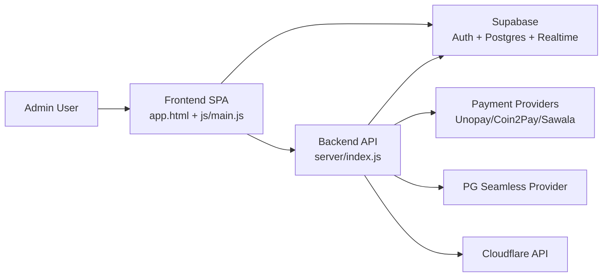
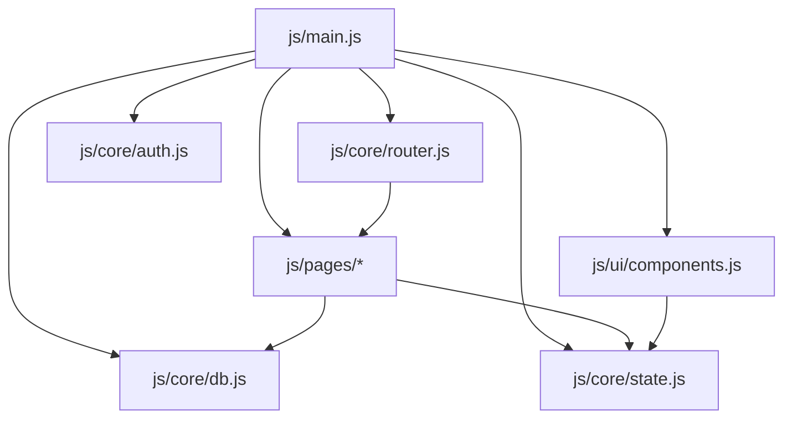
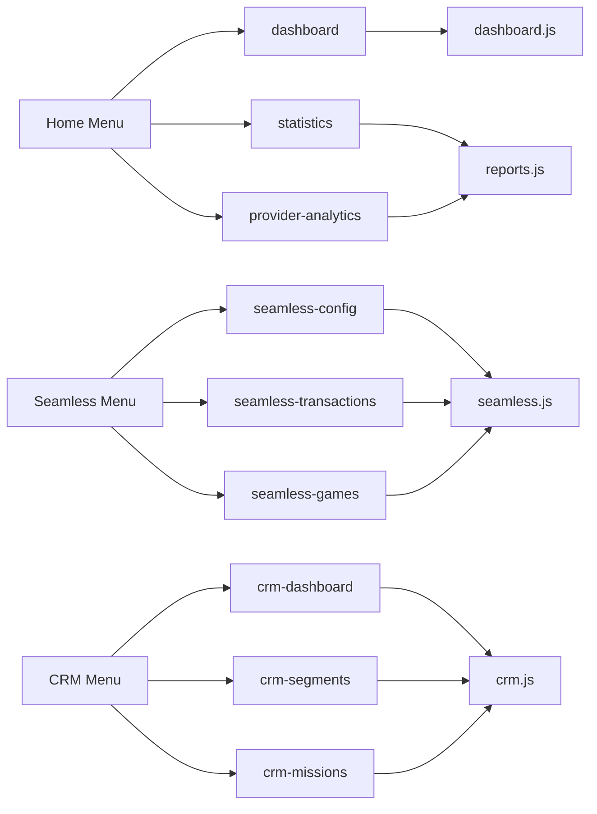
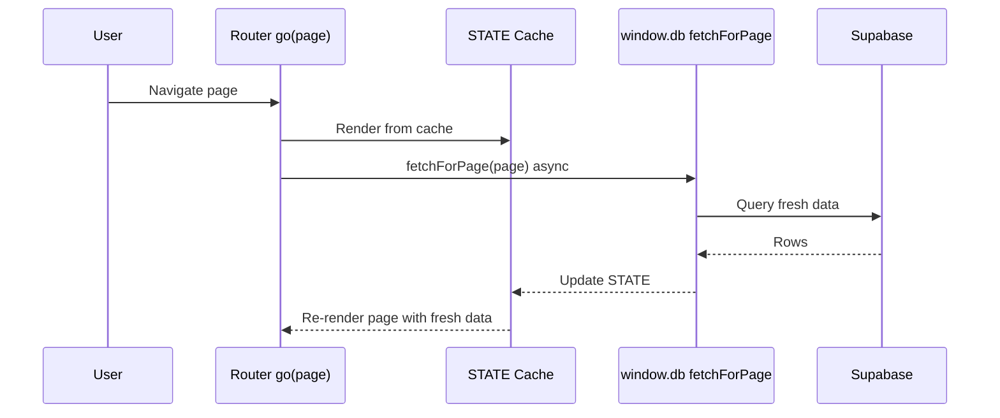
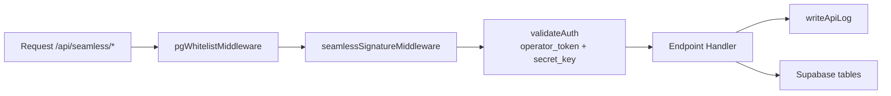
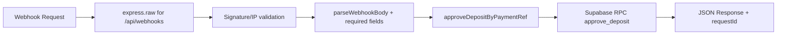
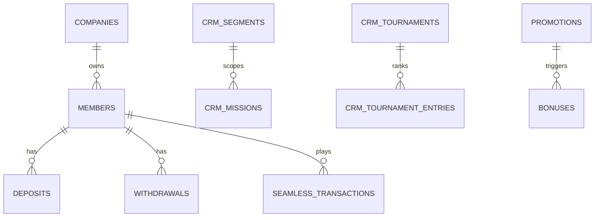
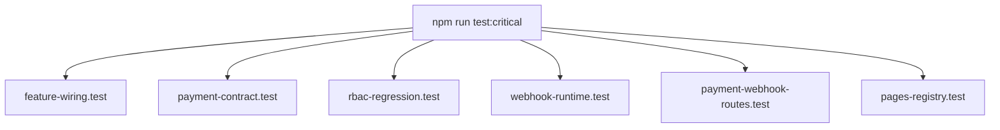

# VIGOR Architecture Diagrams (Mermaid)
Tanggal: 2026-05-07

## 1) System Context


## 2) Frontend Module Graph


## 3) Lazy Route Resolver
```mermaid
flowchart TD
  GO[go(page)] --> RESOLVE[ensurePageForRoute(page)]
  RESOLVE --> LM[lazyPageModules matcher]
  LM -->|match| IMPORT[Dynamic import js/pages/*.js]
  IMPORT --> REG[pages['route']=renderFn]
  REG --> RENDER[content.innerHTML = pages[page]()]
  RENDER --> SWR[db.fetchForPage(page)\nbackground refresh]
```

## 4) Menu -> Page -> Module Correlation


## 5) Frontend Data Flow (SWR)


## 6) Backend Route Topology
```mermaid
flowchart TD
  IDX[server/index.js] --> SEAM[/api/seamless]
  IDX --> WEBH[/api/webhooks]
  IDX --> PAY[/api/payments]
  IDX --> CF[/api/cloudflare]
  IDX --> ADM[/api/admin]

  SEAM --> RSEAM[server/routes/seamless.js]
  WEBH --> RPAY[server/routes/payment.js]
  PAY --> RPAY
  CF --> RCF[server/routes/cloudflare.js]
  ADM --> RADM[server/routes/admin.js]
```

## 7) Seamless Security Pipeline


## 8) Payment Webhook Pipeline


## 9) Database Domains


## 10) Test Coverage Map


